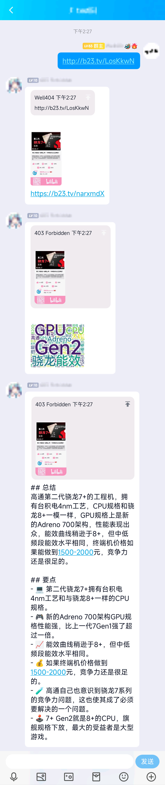
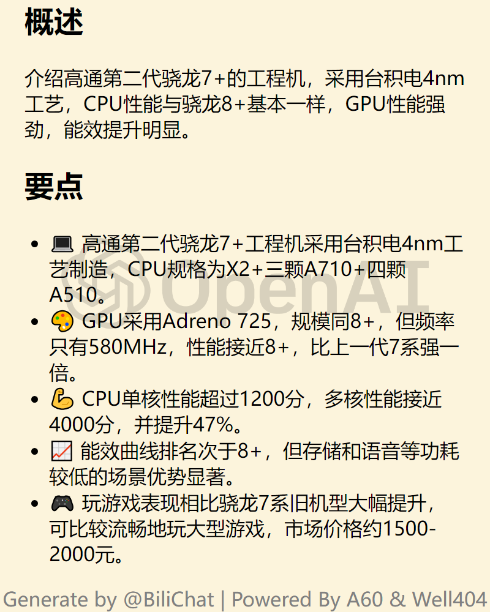

<div align="center">
  <a href="https://v2.nonebot.dev/store"></a>
  <br>
  <p></p>
</div>

<div align="center">

# nonebot-plugin-bilichat

_✨ 多功能的 B 站视频解析工具 ✨_

<a href="./LICENSE">
    
</a>

<a href="https://pypi.python.org/pypi/nonebot-plugin-bilichat">
  
</a>

<a href="https://pypi.python.org/pypi/nonebot-plugin-bilichat">
    
</a>


<a href="https://pdm.fming.dev">
    
</a>

<a href="https://github.com/psf/black">
    
</a>

<a href="https://jq.qq.com/?_wv=1027&k=5OFifDh">
  
</a>
<a href="https://jq.qq.com/?_wv=1027&k=7LWx6q4J">
  
</a>

</div>

## 📖 介绍

视频链接解析，并根据其内容生成**基本信息**、**词云**和**内容总结**

<details>
<summary>手机端视图</summary>



</details>

<details>
<summary>基本信息</summary>


</details>

<details>
<summary>词云</summary>


</details>

<details>
<summary>视频总结</summary>



</details>

## 💿 安装

> Linux 用户在安装时如果出现 `libGL.so.1: cannot open shared object file: No such file or directory` 错误，说明缺少 OpenGL 的运行环境，可以参考 [dynamicrender](https://pypi.org/project/dynrender-skia/) 中的 README 安装对应的依赖后重试

<details>
<summary>使用 nb-cli 安装</summary>
在 nonebot2 项目的根目录下打开命令行, 输入以下指令即可安装

    nb plugin install nonebot-plugin-bilichat

注: 由于 nb-cli 不支持依赖组，因此需要启用词云和 AI 总结的用户要通过其他的包管理器安装额外的依赖

    pip install nonebot-plugin-bilichat[all]

</details>

<details>
<summary>使用包管理器安装</summary>
在 nonebot2 项目的插件目录下, 打开命令行, 根据你使用的包管理器, 输入相应的安装命令

<details>
<summary>pip</summary>

    pip install nonebot-plugin-bilichat[all]

</details>
<details>
<summary>pdm</summary>

    pdm add nonebot-plugin-bilichat[all]

</details>
<details>
<summary>poetry</summary>

    poetry add nonebot-plugin-bilichat[all]

</details>
<details>
<summary>conda</summary>

    conda install nonebot-plugin-bilichat[all]

</details>

打开 nonebot2 项目根目录下的 `pyproject.toml` 文件, 在 `[tool.nonebot]` 部分追加写入

    plugins = ["nonebot_plugin_bilichat"]

</details>

## ⚙️ 配置

在 nonebot2 项目的`.env`文件中添加下表中的配置, 配置均为**非必须项**

### 太长不看版

一般来说，你只需要关注以下几个配置项

```
# 对同一视频的响应冷却时间(防止刷屏)
bilichat_cd_time = 120
# 网络请求重试次数
bilichat_neterror_retry = 3
# 是否使用浏览器截图(需要额外依赖)
bilichat_use_browser = True

# 是否开启词云(需要额外依赖)
bilichat_word_cloud = True

# === AI 总结相关 ===
# 官方总结接口
bilichat_official_summary = True
# openai 接口(需要额外依赖)
bilichat_openai_token = sk-xxxxxxx
# 网络代理
bilichat_openai_proxy = "http://127.0.0.1:7890/"
```

### 通用配置项

|            配置项             |   类型    |  默认值  |                               说明                               |
| :---------------------------: | :-------: | :------: | :--------------------------------------------------------------: |
|        bilichat_block         |   bool    |  False   |                是否拦截事件(防止其他插件二次解析)                |
|     bilichat_enable_self      |   bool    |  False   |                      是否允许响应自身的消息                      |
|      bilichat_only_self       |   bool    |  False   | 是否仅响应自身的消息，开启后会**覆盖全部其他规则**(人机合一特供) |
|      bilichat_only_to_me      |   bool    |  False   |      非自身消息是否需要 `@机器人` 或使用机器人的昵称才响应       |
|      bilichat_whitelist       | list[str] |    []    |                 **响应**的会话名单, 会覆盖黑名单                 |
|      bilichat_blacklist       | list[str] |    []    |                       **不响应**的会话名单                       |
|     bilichat_dynamic_font     |    str    |   None   |                   视频信息及词云图片使用的字体                   |
|       bilichat_cd_time        |    int    |   120    |                对同一视频的响应冷却时间(防止刷屏)                |
|    bilichat_neterror_retry    |    int    |    3     |                   对部分网络请求错误的尝试次数                   |
|     bilichat_use_bcut_asr     |   bool    |   True   |             是否在**没有字幕时**调用必剪接口生成字幕             |
|    bilichat_show_error_msg    |   bool    |   True   |                   是否在解析失败时发送错误信息                   |
|     bilichat_use_browser      |   bool    |   Auto   |     是否使用浏览器，`Auto` 会根据是否含有相应的依赖进行选择      |
| bilichat_browser_shot_quality |    int    |    75    |      浏览器截图质量，取值范围 10-100，越高则截图的体积越大       |
|     bilichat_cache_serive     |    str    |   Auto   |         使用的缓存类型，可用类型包含 `json` 和 `mongodb`         |
|      bilichat_text_fonts      |    str    | default  |          可供自定义的字体，仅作用于 dynamicrender 绘图           |
|     bilichat_emoji_fonts      |    str    | default  |          可供自定义的字体，仅作用于 dynamicrender 绘图           |
|      bilichat_webui_path      |    str    | bilichat |               WebUI 的路径，设置为空则不开启 WebUI               |

注:

1. 由于 OneBot 协议未规定是否应上报自身事件，因此在不同的场景下能否获取自身事件并不一定，`bilichat_enable_self` 实际能否生效也与之相关
2. 当 `bilichat_whitelist` 存在时，`bilichat_blacklist` 将会被禁用
3. `bilichat_dynamic_font` 可填写自定义的字体 url，但并不推荐修改
4. 当使用 `bcut_asr` 接口来生成 AI 字幕时，根据视频时长和网络情况有可能会识别失败，Bot 会提示 `BCut-ASR conversion failed due to network error`。可以通过调高 `bilichat_neterror_retry` 次数或几分钟后重试来尝试重新生成字幕
5. 当 `bilichat_cache_serive` 为 `mongodb` 时，需要安装并配置 [nonebot-plugin-mongodb](https://github.com/Well2333/nonebot-plugin-mongodb) 才可正常使用

### 指令配置项

|          配置项           |   类型    |          默认值          |           说明            |
| :-----------------------: | :-------: | :----------------------: | :-----------------------: |
|  bilichat_command_to_me   |   bool    |           True           |    命令是否需要@机器人    |
|    bilichat_cmd_start     |    str    |        "bilichat"        | 命令的起始词，可设置为空  |
|   bilichat_cmd_add_sub    | list[str] |     ["订阅", "关注"]     |      "sub"命令的别名      |
|  bilichat_cmd_remove_sub  | list[str] |     ["退订", "取关"]     |     "unsub"命令的别名     |
|  bilichat_cmd_check_sub   | list[str] |   ["查看", "查看订阅"]   |     "check"命令的别名     |
|  bilichat_cmd_reset_sub   | list[str] |   ["重置", "重置配置"]   |     "reset"命令的别名     |
|    bilichat_cmd_at_all    | list[str] | ["全体成员", "at 全体"]  |     "atall"命令的别名     |
|   bilichat_cmd_dynamic    | list[str] | ["动态通知", "动态订阅"] |    "dynamic"命令的别名    |
|     bilichat_cmd_live     | list[str] | ["直播通知", "直播订阅"] |     "live"命令的别名      |
| bilichat_cmd_checkdynamic | list[str] |       ["查看动态"]       | "checkdynamic" 命令的别名 |
|    bilichat_cmd_fetch     | list[str] | ["获取内容", "解析内容"] |    "fetch" 命令的别名     |
| bilichat_cmd_check_login  | list[str] |     ["查看登录账号"]     |  "checklogin" 命令的别名  |
| bilichat_cmd_login_qrcode | list[str] |       ["扫码登录"]       |   "qrlogin" 命令的别名    |
|    bilichat_cmd_logout    | list[str] |       ["登出账号"]       |    "logout" 命令的别名    |

### 基础信息配置项

|            配置项            | 类型 | 默认值 |                        说明                        |
| :--------------------------: | :--: | :----: | :------------------------------------------------: |
|     bilichat_basic_info      | bool |  True  |                是否开启视频基本信息                |
|  bilichat_basic_info_style   | str  |  Auto  |       视频详情的图片样式，可用样式见下方备注       |
|   bilichat_basic_info_url    | bool |  True  |   开启视频进本信息的情况下，是否一同回复一个链接   |
| bilichat_reply_to_basic_info | bool |  True  |  后续消息是否回复基础信息(关闭则回复发送者的信息)  |
|       bilichat_dynamic       | bool |  True  |                  是否开启动态解析                  |
|    bilichat_dynamic_style    | str  |  Auto  |       动态详情的图片样式，可用样式见下方备注       |
|   bilichat_bilibili_cookie   | str  |  None  | bilibili 的 cookie 文件路径,`api` 则自动创建空文件 |

> bilichat_basic_info_style 除默认的 bbot_default 使用 PIL 绘图（未开启浏览器时默认选择），其他均依赖于浏览器进行渲染（需要设置 bilichat_use_browser 为 True 或 Auto），其可用的样式如下所示

<details>
<summary>bbot_default （无浏览器时默认）</summary>


</details>

<details>
<summary>style_blue （有浏览器时默认）</summary>


</details>

> bilichat_dynamic_style 除默认的 dynamicrender 使用 Skia 绘图（未开启浏览器时默认选择），其他均依赖于浏览器进行渲染（需要设置 bilichat_use_browser 为 True 或 Auto），其可用的样式如下所示

<details>
<summary>dynamicrender （无浏览器时默认）</summary>


</details>

<details>
<summary>browser_mobile （有浏览器时默认）</summary>


</details>

<details>
<summary>browser_pc</summary>


</details>

### 词云配置项

开启此功能需要安装对应的依赖 `nonebot-plugin-bilichat[wordcloud]`

|          配置项          |   类型    |   默认值    |       说明       |
| :----------------------: | :-------: | :---------: | :--------------: |
|   bilichat_word_cloud    |   bool    |    False    | 是否开启词云功能 |
| bilichat_word_cloud_size | list[int] | [1000, 800] |   词云图片尺寸   |

### AI 视频总结配置项

开启此功能需要安装对应的依赖 `nonebot-plugin-bilichat[summary]`

|            配置项            | 类型 |       默认值       |                                      说明                                      |
| :--------------------------: | :--: | :----------------: | :----------------------------------------------------------------------------: |
| bilichat_summary_ignore_null | bool |        True        |                            是否忽略无意义的总结内容                            |
|  bilichat_official_summary   | bool |       False        |      是否开启官方总结，此总结独立于下方 AI 总结，可与下方 AI 总结同时生效      |
|    bilichat_openai_token     | str  |        None        |                   openai 的 apikey, 若留空则禁用 openai 总结                   |
|    bilichat_openai_proxy     | str  |        None        |                     访问 openai 或 newbing 使用的代理地址                      |
|    bilichat_openai_model     | str  | gpt-3.5-turbo-0301 |                               使用的语言模型名称                               |
| bilichat_openai_token_limit  | int  |        3500        | 请求的文本量上限, 计算方式可参考[tiktoken](https://github.com/openai/tiktoken) |
|   bilichat_openai_api_base   | str  |  see description   |                  默认为 `https://api.openai.com`，可自行替换                   |

注:

1. openai 需求科学上网才能使用，国内服务器请务必填写 `bilichat_openai_proxy` 或全局透明代理
2. 由于 newbing 接口限制以及能力下降，现已移除支持
3. 官方总结目前为内测状态，之后接口随时可能会有变化，请注意及时更新

## 🎉 使用

直接发送视频(专栏)链接即可

### 参数表

在发送视频时，可以额外添加以下类似 shell 指令的参数，进而对解析流程进行调整。例如

```shell
BV12v4y1E7NT --refresh
BV12v4y1E7NT -r # 可以使用简写
BV12v4y1E7NT -r --no-cache # 可以多个参数混用
BV12v4y1E7NT -rn # 可以将简写合并，效果同上一条
-r BV12v4y1E7NT -n # 虽然不建议，但确实可以把参数放前面
```

|    指令    | 简写 |                        说明                        |
| :--------: | :--: | :------------------------------------------------: |
| --no-cache |  -n  |     本次总结禁用缓存(不会影响已存在的缓存文件)     |
| --refresh  |  -r  | 刷新此视频的词云和总结缓存(会覆盖已存在的缓存文件) |
|  --force   |  -f  |             忽略 cd 时间，强制解析视频             |

### 指令表

指令部分由 `指令前缀` 和 `指令名` 组成，其中 `指令前缀` 包含 `COMMAND_START` `bilichat_cmd_start` `COMMAND_SEP` 三部分，默认的 `指令前缀` 为 `/bilichat.` ，即完整的指令为 `/bilichat.xxx`

`指令前缀` 部分也是可以修改的，例如 .env 中填入如下设置即可实现无 `指令前缀`

```dotenv
COMMAND_SEP=[""]
COMMAND_START=[""]
bilichat_cmd_start=""
```

`指令名` 如下表所示，其中除登录相关的指令均可自定义，可参考上文的 [指令及订阅配置项](#指令及订阅配置项)

|     指令     |  权限  |  范围  |                  参数                  |                   说明                   |
| :----------: | :----: | :----: | :------------------------------------: | :--------------------------------------: |
|     sub      |  主人  |  群聊  |           UP 主的昵称或 UID            |                 添加订阅                 |
|    unsub     |  主人  |  群聊  |      UP 主的昵称或 UID，或 `all`       |         移除订阅，all 时为全移除         |
|    check     | 无限制 |  群聊  |       UP 主的昵称或 UID，或留空        |    查看本群订阅列表或指定 UP 主的配置    |
|    reset     |  主人  |  群聊  |      UP 主的昵称或 UID，或 `all`       | 重置指定 UP 主的推送配置，all 时为全重置 |
|    atall     |  主人  |  群聊  | UP 主的昵称或 UID `全局` `动态` `直播` |           设置是否 at 全体成员           |
|   dynamic    |  主人  |  群聊  |           UP 主的昵称或 UID            |         是否开启该 UP 的动态通知         |
|     live     |  主人  |  群聊  |           UP 主的昵称或 UID            |         是否开启该 UP 的直播通知         |
| checkdynamic | 无限制 | 无限制 |           UP 主的昵称或 UID            |       查看指定 UP 主的最新一条动态       |
|    fetch     | 无限制 | 无限制 |    动态 ID，或回复包含此内容的消息     |            解析动态包含的图片            |
|  checklogin  |  主人  | 无限制 |                   无                   |         查看当前已登录的全部账号         |
|   qrlogin    |  主人  | 无限制 |                   无                   |      使用二维码登录 B 站，防止风控       |
|    logout    |  主人  | 无限制 |               账号的 UID               |              登出指定的账号              |

## 🙏 感谢

在此感谢以下开发者(项目)对本项目做出的贡献：

-   [BibiGPT](https://github.com/JimmyLv/BibiGPT) 项目灵感来源
-   [bilibili-API-collect](https://github.com/SocialSisterYi/bilibili-API-collect) 易姐收集的各种 BiliBili Api 及其提供的 gRPC Api 调用方案
-   [HarukaBot](https://github.com/SK-415/HarukaBot) 功能来源
-   [BBot-Graia](https://github.com/djkcyl/BBot-Graia) 功能来源 ~~(我 牛 我 自 己)~~
-   [ABot-Graia](https://github.com/djkcyl/ABot-Graia) 永远怀念最好的 ABot 🙏
-   [bilireq](https://github.com/SK-415/bilireq) 项目使用的 bilibili 请求库
-   [nonebot-plugin-template](https://github.com/A-kirami/nonebot-plugin-template): 项目的 README 模板
-   [Misaka-Mikoto-Tech](https://github.com/Misaka-Mikoto-Tech) 为本项目提交了多项 BUG 修复和代码参考
-   [hamo-reid](https://github.com/hamo-reid) 为 style_blue 绘制了界面
-   [dynamicrender](https://pypi.org/project/dynrender-skia/) 提供 t2i 和动态渲染
-   [ALC](https://github.com/nonebot/plugin-alconna) 提供跨平台支持

## ⏳ Star 趋势

[](https://starchart.cc/djkcyl/nonebot-plugin-bilichat)
